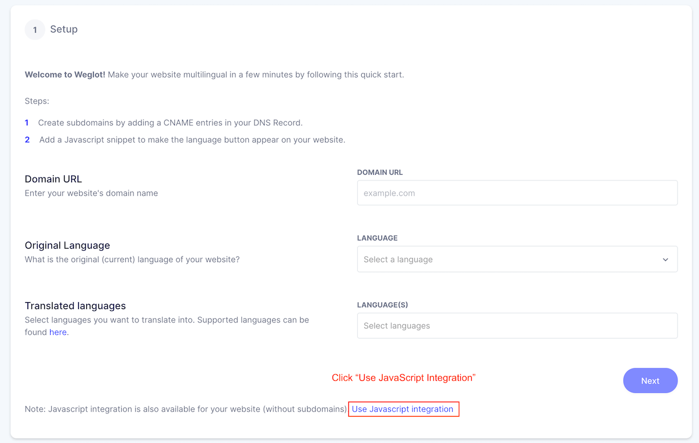

# weglot-integration plugin for Craft CMS 3.x

Weglot integration


## Requirements

This plugin requires Craft CMS 3.0.0-beta.23 or later. And you need [Weglot Account](https://weglot.com/).

## Installation

To install the plugin, follow these instructions.

1. Open your terminal and go to your Craft project:

        cd /path/to/project

2. Then tell Composer to load the plugin:

        composer require Ippey/weglot-integration

3. In the Control Panel, go to Settings → Plugins and click the “Install” button for weglot-integration.

## weglot-integration Overview

This plugin provides to switch language easily via Weglot.
Weglot translates automatically instead of you.

<a href="https://dashboard.weglot.com/register?fp_ref=ippei19" target="_blank" style="outline:none;border:none;">

</a>

## Configure

You need to get API Key from [Weglot Dashboard](https://dashboard.weglot.com/), and please save it on setting page.
This plugin uses "JavaScript Integration". Please click "Use JavaScript Integration", when you set up a Weglot Project.



## How to use
### Twig Extension
#### Automatically translation
**UPDATE** You don't need to use Twig filter. This plugin adds script tag automatically.

You can see a language switcher lower right. The page will be translated automatically if you switch other language.

#### Manually translation

Use bellow Twig filter if you want to translate manually.

```
{{ '攻殻機動隊' | weglot_translate('ja', 'en') }}
Ghost in the Shell.
```

### Service

You can also translate using plugin's service in your PHP Code.

```php
$text = 'Spirited Away';
$from = 'en';
$to = 'ja';
$translated = \ippey\weglotintegration\Weglotintegration::getInstance()->weglotService->translate($text, $from, $to);
echo ($translated); // 千と千尋の神隠し
```
